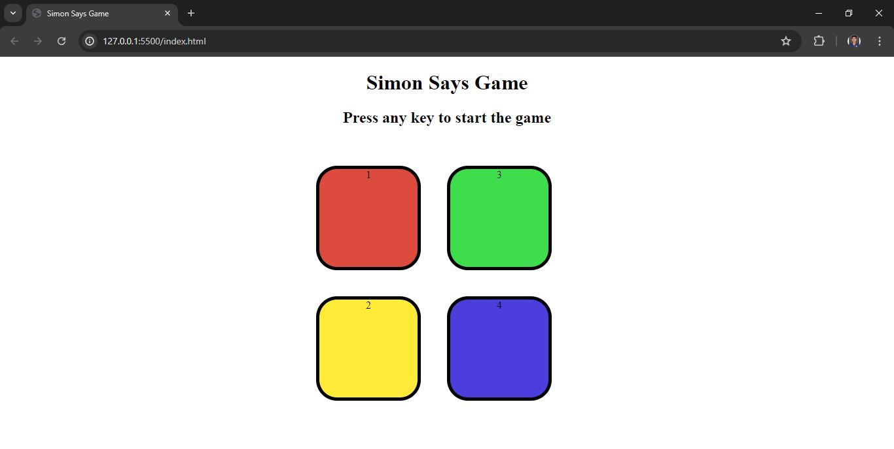
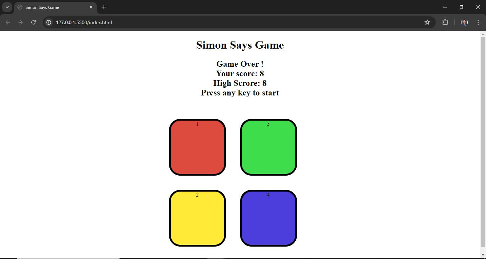

# Simon Says Game

Welcome to the Simon Says Game! This is a simple yet challenging game where you need to remember and repeat a sequence of colors that grows longer with each round.

## Introduction

The Simon Says Game is a fun and interactive way to test and improve your memory skills. The game generates a random sequence of colors that you must repeat in the correct order. The sequence gets longer and more difficult with each level.

## Screenshots

Here are some screenshots of the Simon Says Game:


*Start Screen*


*Game Over*

## Demo Video

Watch a demo of the game in action [here](https://drive.google.com/file/d/1uhyRg7vMfnCHTIoZleZTsEydUmlxzrv5/view?usp=sharing).

## Gameplay

1. Press any key to start the game.
2. Watch the sequence of button flashes.
3. Click the buttons in the same order as they were shown.
4. If you repeat the sequence correctly, the game will add another step to the sequence.
5. The game continues until you make a mistake.
6. Your score is the number of steps in the sequence you remembered correctly.

## Technologies Used

- HTML
- CSS
- JavaScript

## How to Play

1. Clone or download the repository.
2. Open the `index.html` file in your web browser.
3. Press any key to start the game.
4. Follow the sequence of flashes.
5. Click the buttons in the correct order to match the sequence.
6. If you make a mistake, the game ends and your score is displayed.

## Learning

By creating this project, I learned the following JavaScript concepts and techniques:

1. **Event Handling**: Adding event listeners to handle user interactions, such as keypresses and button clicks.

2. **DOM Manipulation**: Selecting and manipulating DOM elements to update the game's state, display messages, and provide visual feedback.

3. **State Management**: Managing game states using variables to track the sequence, the user's progress, the current level, and the high score.
    
4. **Random Number Generation**: Creating the game's sequence of button presses.
    
5. **Conditional Logic**: Checking the user's input against the game's sequence and determining if the game should continue or end.
   
## Future Enhancements

1. **Sound Effects**: Add sound effects for each button press to enhance the gameplay experience.
2. **Mobile Optimization**: Optimize the game layout and controls for mobile devices.
3. **Advanced Levels**: Introduce different difficulty levels with faster sequences and more colors.
4. **Scoreboard**: Implement a scoreboard to keep track of high scores.
5. **Animations**: Add smoother and more engaging animations for button presses and transitions.

## Installation

1. Clone the repository:
    ```bash
    git clone https://github.com/ratnesh1253/simon-says-game.git
    ```
2. Navigate to the project directory:
    ```bash
    cd simon-says-game
    ```
3. Open the `index.html` file in your preferred web browser.

## Contributing

Contributions are welcome! If you have any ideas for improvements or new features, please feel free to fork the repository and submit a pull request. 

## Contact

If you have any questions or suggestions, feel free to contact me at [email](mailto:ratneshkshirsagar1253@gmail.com).

---

Enjoy playing the Simon Says Game and challenge yourself to achieve a new high score!
```
